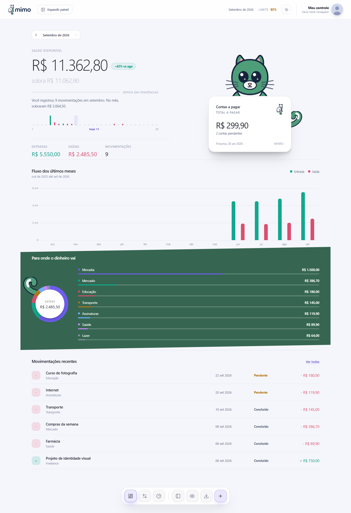
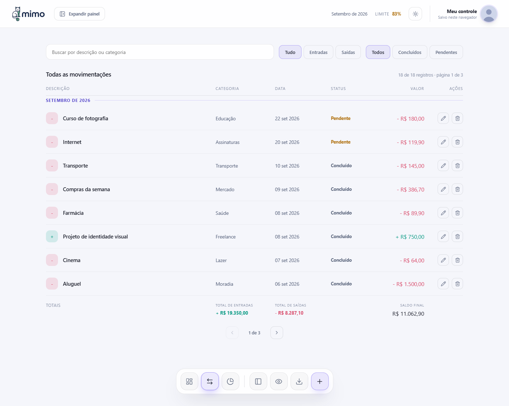
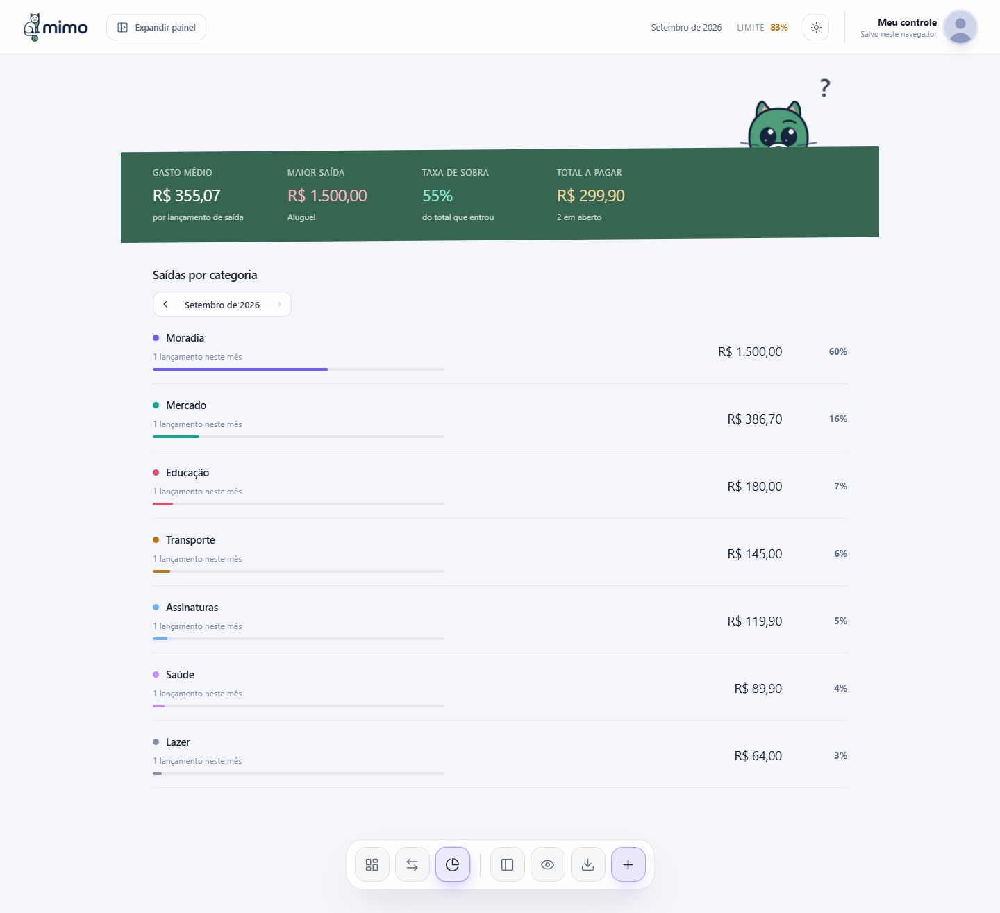
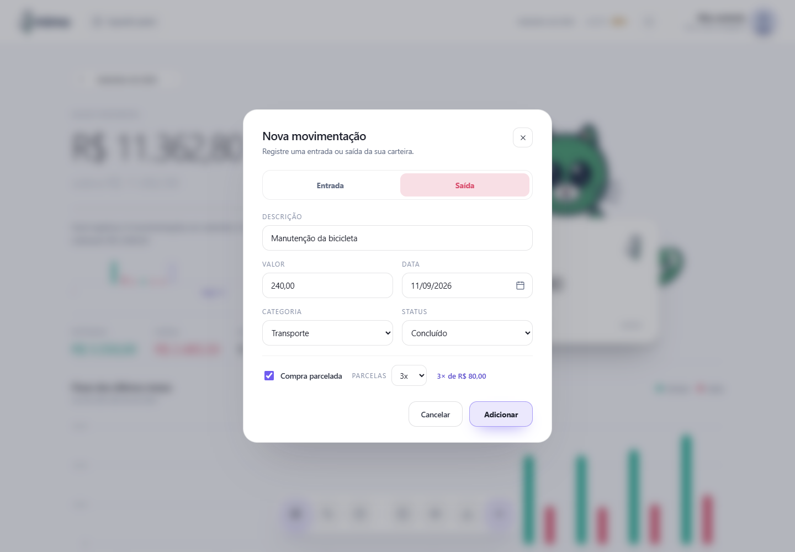
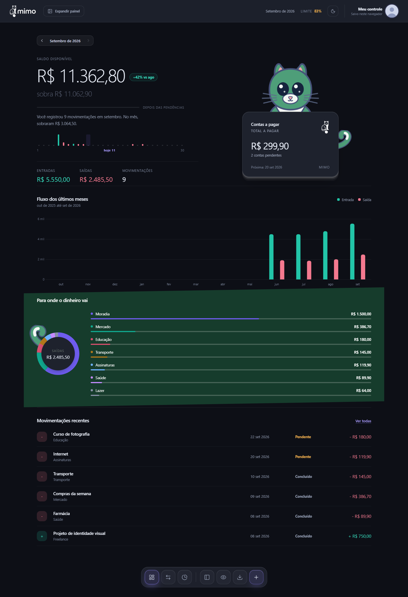
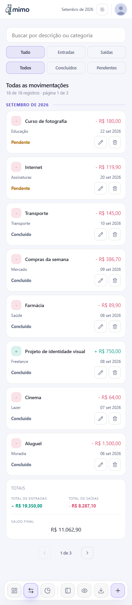

<div align="center">
  <picture>
    <source media="(prefers-color-scheme: dark)" srcset="assets/mimo-logo-dark.svg">
    <source media="(prefers-color-scheme: light)" srcset="assets/mimo-logo.png">
    
  </picture>
  <h1>Mimo</h1>
  <p>Seu dinheiro, mês a mês.</p>
  <p>Controle de gastos pessoais direto no navegador, com entradas, saídas, parcelas e categorias.</p>
  <p>
    <a href="#comece-a-usar">Comece a usar</a> &nbsp;·&nbsp;
    <a href="#telas">Telas</a> &nbsp;·&nbsp;
    <a href="#seus-dados">Seus dados</a> &nbsp;·&nbsp;
    <a href="#desenvolvimento">Desenvolvimento</a>
  </p>
</div>



O Mimo reúne os lançamentos do dia a dia em um painel com saldo, histórico mensal e contas pendentes. Funciona com HTML, CSS e JavaScript, sem cadastro, banco de dados ou etapa de build.

**A primeira abertura começa vazia.** Os dados das capturas foram cadastrados apenas para apresentar as telas e removidos depois. Nenhum lançamento de demonstração é criado pelo aplicativo.

## Comece a usar

1. [Baixe o projeto em ZIP](https://github.com/vitorcgo/MIMO-GerenciadordeGastos/archive/refs/heads/main.zip) e extraia a pasta. Se preferir, clone o repositório:

   ```bash
   git clone https://github.com/vitorcgo/MIMO-GerenciadordeGastos.git
   cd MIMO-GerenciadordeGastos
   ```

2. Com o [Node.js](https://nodejs.org/) 18 ou superior instalado, abra o terminal na pasta do projeto e execute:

   ```bash
   npm start
   ```

   Não é necessário executar `npm install`. O servidor usa apenas módulos incluídos no Node.js. Você também pode iniciá-lo com `node scripts/serve.cjs`.

3. Acesse **[127.0.0.1:8000](http://127.0.0.1:8000)** no navegador.

4. Clique em **Adicionar movimentação** ou no botão **+**. Preencha a descrição, o valor, a data, a categoria e o status.

Para definir seu orçamento, abra **Expandir painel**, informe o limite mensal e clique em **Salvar**. O limite começa sem valor definido; deixar o campo em branco remove a configuração.

<details>
<summary>Outras formas de abrir</summary>

Se você já tem Python instalado, pode servir a pasta com:

```bash
python -m http.server 8000 --bind 127.0.0.1
```

Também é possível abrir `index.html` diretamente. Prefira o servidor local para manter um endereço estável e evitar diferenças no armazenamento de arquivos locais entre navegadores.

Para publicar em uma hospedagem estática, copie `index.html`, `app.js`, `styles.css`, `mobile.css` e a pasta `assets/`. Não há compilação ou configuração de backend.

</details>

## No dia a dia

| Recurso | O que você pode fazer |
| :--- | :--- |
| Movimentações | Registrar, editar e excluir entradas e saídas. |
| Parcelas | Dividir um lançamento em até 24 parcelas mensais, com ajuste de centavos. |
| Histórico | Navegar entre meses e acompanhar entradas e saídas no gráfico. |
| Categorias | Comparar os gastos por categoria e consultar os maiores lançamentos. |
| Pendências | Acompanhar contas em aberto, inclusive de meses anteriores. |
| Limite mensal | Definir um valor de referência e acompanhar o consumo do orçamento. |
| Busca e filtros | Encontrar registros por descrição, categoria, tipo e status. |
| Exportação | Baixar todas as movimentações em CSV para consultar em uma planilha. |
| Aparência | Alternar entre tema claro e escuro, no computador ou no celular. |
| Ocultar valores | Esconder valores monetários da tela com o botão de privacidade. |

## Telas

Capturas reais do aplicativo em execução, com lançamentos fictícios usados somente nesta apresentação. Clique em uma imagem para vê-la em tamanho original.

<table>
  <tr>
    <td width="50%"><strong>Movimentações</strong><br><br><a href="docs/screenshots/movimentacoes.png"></a></td>
    <td width="50%"><strong>Categorias</strong><br><br><a href="docs/screenshots/categorias.png"></a></td>
  </tr>
</table>

<details>
<summary><strong>Cadastro e parcelamento</strong></summary>
<br>

</details>

<details>
<summary><strong>Visão geral no tema escuro</strong></summary>
<br>

</details>

<details>
<summary><strong>Veja a versão para celular</strong></summary>
<br>
<p align="center">
  <a href="docs/screenshots/mobile.png"></a>
</p>
</details>

## Como os valores são calculados

- **Saldo disponível:** entradas concluídas menos saídas concluídas, acumuladas até o fim do mês selecionado.
- **Depois das pendências:** saldo disponível menos as contas a pagar até aquele mês. Se o resultado for negativo, a tela informa quanto falta.
- **Entradas, saídas e categorias:** consideram os lançamentos do mês selecionado, incluindo pendentes.
- **Totais da lista:** acompanham a busca e os filtros e somam todos os resultados, incluindo os de outras páginas.
- **Parcelas:** cada parcela vira um registro no mês correspondente. As parcelas seguintes começam como pendentes. Editar uma parcela altera apenas aquele registro.

As categorias são fixas. O limite mensal é uma configuração geral aplicada ao mês exibido, sem orçamento separado para cada mês.

## Seus dados

As movimentações e preferências ficam no `localStorage` do navegador. O Mimo não envia esses registros a um servidor e não sincroniza dados entre dispositivos.

Use sempre o mesmo navegador, perfil e endereço. `localhost`, `127.0.0.1` e portas diferentes possuem armazenamentos separados. Limpar os dados do site ou encerrar uma sessão privada pode apagar os registros.

O botão **Exportar CSV** baixa todas as movimentações. Guarde uma cópia periodicamente. O CSV serve para consulta em planilhas; esta versão não tem importação de arquivos.

Atualizações preservam os registros já salvos. Se você usou uma versão antiga com exemplos, eles podem continuar no seu navegador: exclua os lançamentos desejados na tela de movimentações. A versão atual não recria esses exemplos, nem ao apagar o último registro.

Os gráficos e ícones estão incluídos em `assets/vendor/` e funcionam sem internet. As fontes Sora e Manrope são solicitadas ao Google Fonts; sem conexão, o navegador utiliza fontes do sistema.

Se aparecer um aviso de falha no armazenamento, consulte [Recuperação de dados locais](docs/recuperacao.md). Uma gravação malsucedida não é apresentada como concluída.

## Desenvolvimento

```text
MIMO-GerenciadordeGastos/
├── index.html          Estrutura das telas e formulários
├── app.js              Estado, cálculos, persistência e eventos
├── styles.css          Estilos e temas
├── mobile.css          Adaptações para telas menores
├── assets/             Marca, ícones e bibliotecas locais
├── docs/               Capturas de tela e recuperação de dados
├── scripts/serve.cjs    Servidor local sem dependências
└── tests/app.test.cjs   Testes de dados e cálculos
```

Execute os testes com:

```bash
npm test
```

Os testes cobrem a primeira visita vazia, a exclusão de todos os registros, a preservação de dados existentes, valores inválidos, parcelas e o cálculo de saldo e pendências. Os registros de teste não são carregados pelo aplicativo.

O código não exige framework ou gerenciador de pacotes para funcionar. As bibliotecas incluídas são [Chart.js 4.5.1](https://www.chartjs.org/) e [Lucide 1.37.0](https://lucide.dev/), com as licenças preservadas em [assets/vendor](assets/vendor/).
